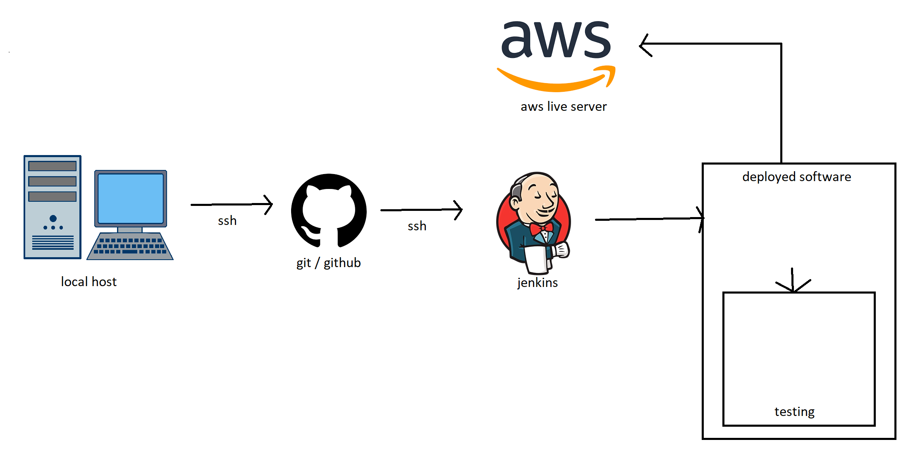

# CICD With Jenkins

### What is CI/CD?

CI/CD is a method to frequently deliver apps to customers by introducing automation into the stages of app development. The main concepts attributed to CI/CD are continuous integration, continuous delivery, and continuous deployment.

### How to setup up ssh connection with jenkins

1) Generate new ssh key in your ssh folder and name it (name)jenkins.
2) Copy public ssh key into github the .pub file - (name)jenkins.pub.
3) Copy private ssh key into Jenkins - (name)jenkins.
4) Add the git-hub repo web url in the git project to jenkins.
5) Add ssh git-hub url into repository URL under the section `source code management - git`.
6) Set the execute shell to:
```
cd app
npm install
npm test
```
7) Save the jenkins job and run the build.

### Diagrams


